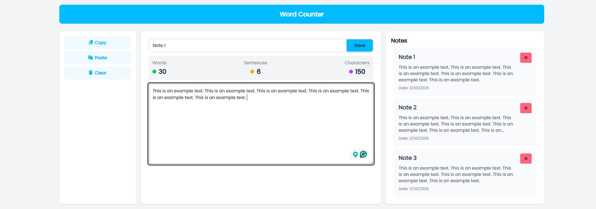

# Word Counter ✍️📊

## Overview

Word Counter is a web application developed using the MEAN stack (MongoDB, Express.js, Angular, Node.js) with Tailwind CSS and DaisyUI for styling. It provides tools to count words, characters, and sentences in text, manage notes, and perform text operations such as copy, paste, and clear. Designed for writers, editors, and anyone working with text, the application is intuitive and efficient.

---

## Features 🚀

- **Text Analysis**: Real-time word, character, and sentence counting.
- **Notes Management**: Create, edit, delete, and save notes seamlessly.
- **Text Operations**:
    - 📋 Copy text to clipboard.
    - 📥 Paste text from clipboard.
    - 🗑️ Clear text input field.
- **Responsive Design**: Built with Tailwind CSS and DaisyUI for a mobile-friendly experience.
- **Real-Time Updates**: Instant synchronization of text changes across components.
- **Database Integration**: Notes are stored and managed using MongoDB.

---

## Screenshots 📸

### Home Page


---

## Tech Stack 🛠️

### Frontend

- **Angular**: Framework for building dynamic user interfaces.
- **Tailwind CSS**: Utility-first CSS framework for modern styling.
- **DaisyUI**: Tailwind CSS plugin offering pre-designed UI components.

### Backend

- **Node.js**: JavaScript runtime for backend development.
- **Express.js**: Framework for building RESTful APIs.
- **MongoDB**: NoSQL database for efficient data storage.

---

## Installation and Setup ⚙️

### Prerequisites

- Node.js (v16 or higher)  
- Angular CLI  
- MongoDB (local or cloud instance) 

### Steps

1. **Clone the Repository**:
     ```bash
     git clone https://github.com/asathsara/word-counter.git
     cd word-counter
     ```
2. **Install Dependencies**:
     ```bash
     npm install
     ```
3. **Start the Backend Server**:
     ```bash
     npm run start:server
     ```
4. **Run the Angular Application**:
     ```bash
     ng serve
     ```
5. **Access the Application**:
     Open your browser and navigate to `http://localhost:4200`.
